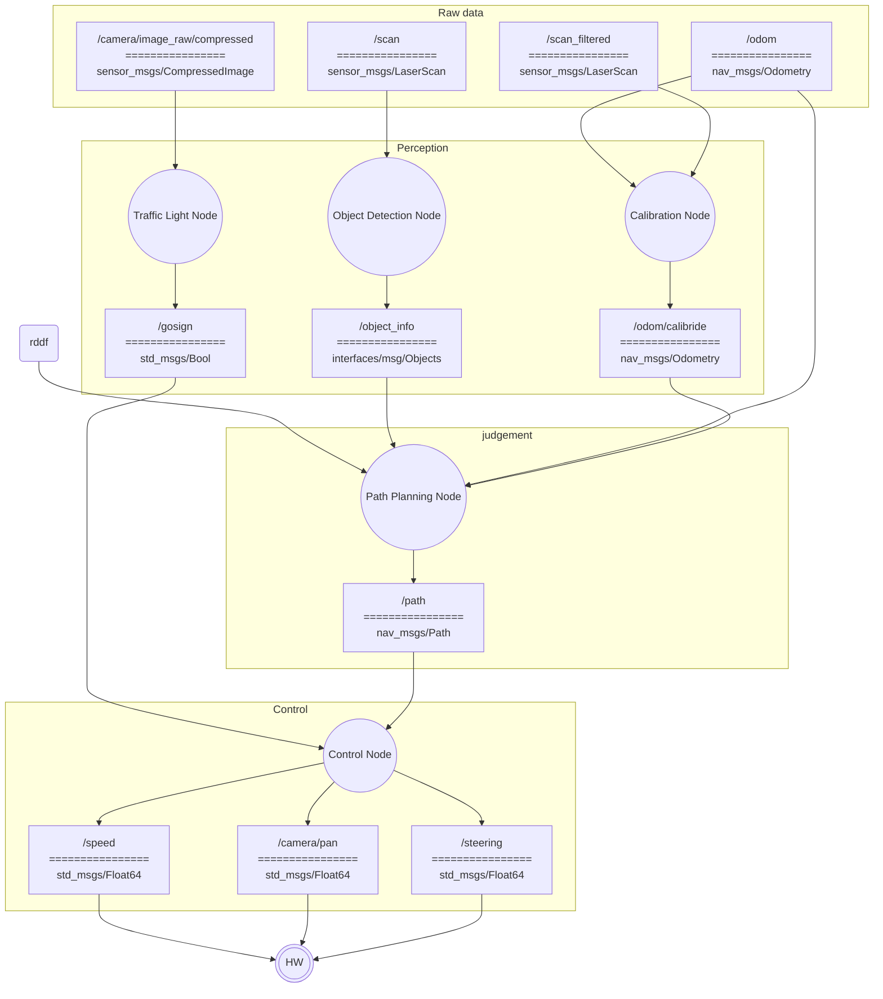

# AMET2026_coex_stier

## How to clone

```bash
mkdir -p /home/physicar
git clone https://github.com/Team-Stier/AMET2026_coex_stier.git /home/physicar/physicar_ws
cd /home/physicar/physicar_ws
```

## Convention

### 좌표계

- 차량의 진행 방향 `+x`
- 진행 방향의 왼쪽 `+y`

## 패키지 구조 설계

- 각 패키지의 소스 코드, 설정, 모델, 테스트 및 패키지 전용 실행 스크립트는 반드시
  `src/<package_name>/` 안에 둔다. 패키지를 개발하면서 저장소 루트나 다른 패키지
  폴더에 소스 코드가 역류하지 않도록 주의한다.
- 프로젝트 내부 패키지는 메시지 전용 `interfaces` 패키지를 제외한 다른 내부 패키지를
  직접 참조하지 않는다. 다른 패키지의 Python 모듈을 import하거나 소스 파일을 상대
  경로로 읽지 않으며, `package.xml`과 빌드 설정에도 다른 내부 패키지 의존성을 추가하지
  않는다.
- 내부 패키지 간 데이터 전달은 ROS 2 토픽, 서비스 또는 액션으로만 수행한다. 패키지
  사이에서 공유해야 하는 메시지·서비스·액션 타입은 `interfaces`에 정의한다.
- `rclpy`, `std_msgs`, `sensor_msgs`, `nav_msgs`와 같은 표준 ROS 2 패키지 및 필요한
  외부 라이브러리 의존성은 각 패키지에서 명시적으로 선언할 수 있다.

### 패키지 구성

```text
src/
├── interfaces/
├── object_detection/
├── traffic_light/
├── calibration/
├── path_planning/
└── control/
```

`interfaces`를 제외한 각 실행 패키지는 동명의 노드 하나와 1:1로 대응한다.
`interfaces`는 실행 노드 없이, 노드 패키지 사이에서 공유하는 사용자 정의 메시지, 서비스 및 액션 타입만 제공한다.

## ROS 2 architecture

ROS 관례에 따라 노드는 원으로, 토픽은 사각형으로 표현한다. 토픽 사각형은
구분선 위에 토픽 이름, 아래에 메시지 타입을 표시한다.



Sensor and control topic contracts follow the
[PhysiCar ROS reference](https://physicar.ai/ko/learn/reference/physicar-ros/).

### Nodes

- **Object Detection Node**: `/scan`의 LiDAR 거리 데이터를 이용해 주행 경로상의 장애물을 클러스터링하고, 장애물들을 원으로 피팅 후 원의 중심점을 리스트로 `/object_info`발행한다.
- **Traffic Light Node**: `/camera/image_raw/compressed`의 카메라 영상에서 `yolo`를 이용해 신호등을 판독하고, 결과를 `/gosign`으로 발행한다. 발행 이후 이 노드는 즉시 종료된다. 실행 환경에 `yolo`sw가 설치 되어 있으므로 개발시 참고하도록 한다.
- **Calibration Node**: `/scan_filtered`의 2D LiDAR 점을 맵 외곽의 네 펜스 선분에 정합해 `/odom`의 x, y, yaw를 보정하고 `/odom/calibride`로 발행한다.
- **Path Planning Node**: RDDF 경로와 `/odom`, `/odom/calibride`, `/object_info`를 이용해 주행 가능한 경로를 계획하고 `/path`로 발행한다.
- **Control Node**: `/path`와 `/gosign`을 바탕으로 차량의 속도, 조향각, 카메라 팬 각도를 계산해 각각의 제어 토픽으로 발행한다.

### Topics

- **`/scan`** (`sensor_msgs/LaserScan`): LiDAR가 측정한 각도별 거리 데이터. Object Detection Node의 입력으로 사용한다.
- **`/camera/image_raw/compressed`** (`sensor_msgs/CompressedImage`): JPEG 형식의 압축 카메라 영상. Traffic Light Node가 구독한다.
- **`/odom`** (`nav_msgs/Odometry`): LiDAR와 IMU를 융합해 추정한 차량의 위치, 자세 및 속도 정보. Path Planning Node와 Calibration Node의 입력으로 사용한다.
- **`/object_info`** (`interfaces/msg/Objects`): Object Detection Node가 생성한 장애물 탐지 결과. 원으로 피팅된 장애물의 중심점의 리스트이다.
```cpp
// interfaces/msg/Objects.msg
std_msgs/Header header

int32 length
float32[20] x
float32[20] y
```
- **`/gosign`** (`std_msgs/Bool`): 신호등 인식 결과에 따른 진행 가능 여부. `true`는 진행 가능, `false`는 정지로 사용한다.
- **`/scan_filtered`** (`sensor_msgs/LaserScan`): Calibration Node가 외곽 펜스 정합에 사용하는 거리 필터링 LiDAR scan.
- **`/odom/calibride`** (`nav_msgs/Odometry`): Calibration Node가 LiDAR 외곽 펜스를 기준으로 보정한 odometry 정보.
- **`/path`** (`nav_msgs/Path`): Path Planning Node가 생성한 차량 주행 경로. Control Node의 입력으로 사용한다.
- **`/speed`** (`std_msgs/Float64`): 차량의 목표 속도 명령. 단위는 m/s이다.
- **`/steering`** (`std_msgs/Float64`): 차량의 목표 조향각 명령. 단위는 rad이며 양수는 좌회전을 의미한다.
- **`/camera/pan`** (`std_msgs/Float64`): 카메라의 목표 팬 각도 명령. 단위는 rad이며 양수는 왼쪽 회전을 의미한다. 실제 서보 위치 피드백이 아니라 명령값이다.

### External inputs and outputs

- **RDDF**: 차량이 따라야 할 기준 경로 데이터로, Path Planning Node의 경로 계획 기준으로 사용한다.
- **HW**: `/speed`, `/steering`, `/camera/pan` 명령을 받아 차량과 카메라를 구동하는 실제 하드웨어 계층이다.

## Bringup
배포 환경에서 프로젝트 루트는 `/home/physicar/physicar_ws`이다. 전체 프로그램은
어느 디렉터리에서든 다음 명령 하나로 빌드하고 실행할 수 있어야 한다.

```bash
source /home/physicar/physicar_ws/run.sh
```

`run.sh`는 source 호출을 감지하면 별도의 Bash 프로세스에서 bringup을 수행해 호출한
셸의 옵션, 작업 디렉터리, trap을 변경하지 않아야 한다. 실행 프로세스는 ROS 2 Jazzy
환경을 불러오고 `colcon build --cmake-clean-cache`를 실행한 뒤,
Object Detection → Traffic Light → Calibration → Path Planning → Control 순서로
노드를 시작한다. Traffic Light Node는 `/gosign` 발행 후 정상 종료할 수 있으며,
나머지 상시 실행 노드가 종료되면 전체 프로그램도 종료한다. `Ctrl+C`를 누르면
스크립트가 실행한 모든 노드를 함께 종료한다.

각 실행 노드 패키지는 `run.sh`를 위해 해당 노드를 올리는 한 줄의 `ros2 run` 명령을 제공해야 한다.
패키지 전용 초기화가 필요한 경우에는 같은 역할을 하는 `./src/<pkgname>/launch.sh`를
추가할 수 있다. 메시지 전용 `interfaces` 패키지는 이 규칙의 대상이 아니다. 노드 내부
알고리즘이나 의존성이 추가되더라도 아래 실행 계약은 유지한다.

```bash
ros2 run object_detection object_detection_node
ros2 run traffic_light traffic_light_node
ros2 run calibration calibration_node
ros2 run path_planning path_planning_node
ros2 run control control_node
```

예를 들어 패키지별 환경변수, 모델 경로, 파라미터 파일 등의 초기화가 필요해
`launch.sh`를 추가했다면, 해당 패키지 개발자는 `run.sh`의 `ros2 run` 실행 줄을
다음 `launch.sh` 실행 줄로 직접 교체해야 한다. `run.sh`는 `launch.sh`의 존재 여부를
자동으로 감지하지 않는다. 아래 스크립트는 선택적 실행 계약의 경로 예시이며, 실제
파일을 추가한 패키지에만 적용한다.

```bash
./src/object_detection/launch.sh
./src/traffic_light/launch.sh
./src/calibration/launch.sh
./src/path_planning/launch.sh
./src/control/launch.sh
```
