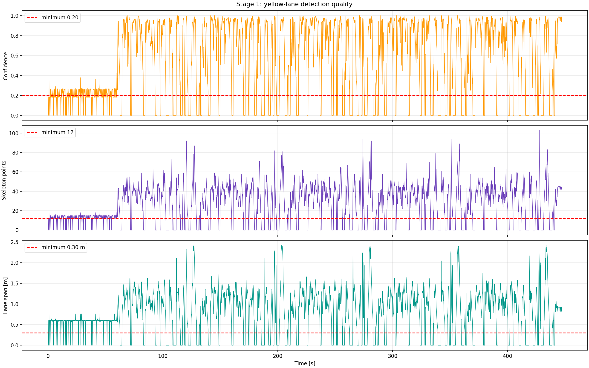
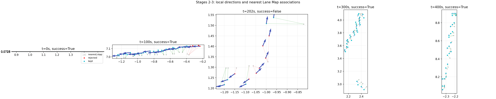
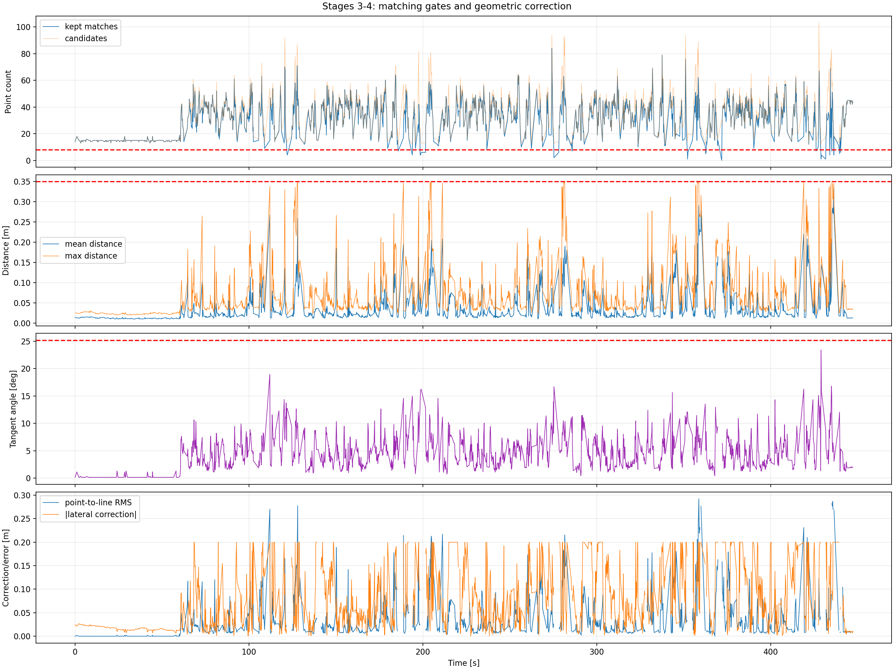
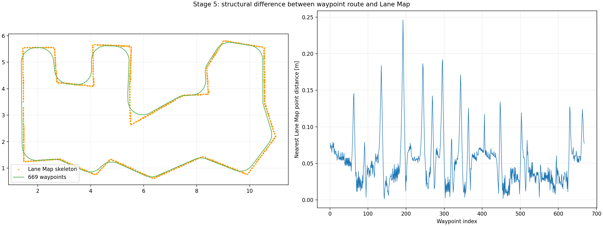
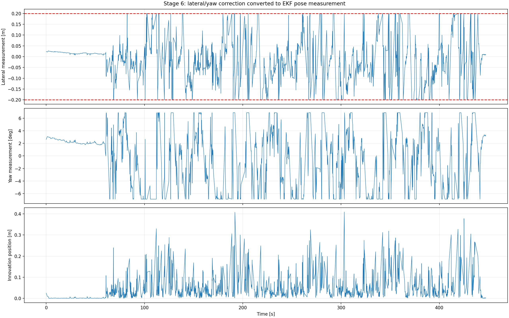
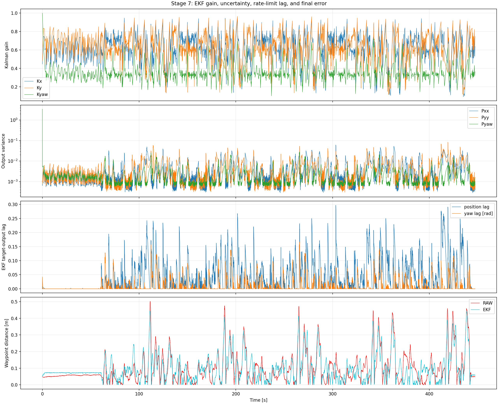
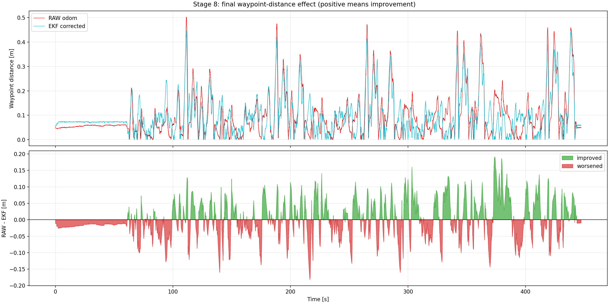

# Rosbag 기반 차선 보정 단계별 분석

## 목적과 재현 범위

`five_lap_localization_20260821_132800_0.mcap` 전체 516.6초를 현재
`calibration_node`와 동일한 검출·최근접 매칭·pose 변환·EKF 코드로 재생했다.
카메라 2,259 프레임과 odom 13,418 표본을 기록했다. waypoint는 주행 명령 경로이지
차량의 독립적인 ground truth pose가 아니다.

재생 도구는 `tools/analyze_calibration_stages.py`다. CSV는 각 단계의 입력과 출력을
연결하므로 임계값을 바꾼 뒤 동일 지표로 비교할 수 있다.

## 결론

현재 보정이 약한 주원인은 EKF보다 앞단이다. 검출이 전체 프레임의 75.5%에서만
유효하고, HSV mask가 일부 구간에서 노란 중앙선 대신 평행한 흰색 경계 또는 다른 도로
표식을 잡는다. 최근접 매칭은 위치 거리와 접선 방향만 보기 때문에 이런 평행 오검출도
높은 성공률로 통과시킨다. 그 결과 큰 오차 구간은 줄지만, 이미 경로에 가까운 구간에는
불필요한 보정을 넣어 전체 표본의 56.7%에서 waypoint 거리를 증가시켰다.

## 단계별 결과

### 1. 노란색 검출

- 유효 검출: 1,706 / 2,259 프레임, 75.5%
- 유효 프레임 평균 confidence: 0.705
- 연속 미검출 최장 구간: 16 프레임, 분석 주기 기준 약 3.2초
- 시작 약 60초는 confidence가 임계값 0.2 부근이고 점 수와 관측 span도 작다.
- [대표 프레임](02_detection_samples.png)의 원본, BEV, binary mask, overlay를 보면
  일부 구간에서 흰색 경계가 mask에 포함된다.

### 2~4. 국소 방향과 최근접 매칭

- 매칭 성공: 1,501 / 1,536회, 97.7%
- 성공 매칭 평균 점 수: 33.19, 평균 point-to-line RMS: 0.0352 m
- RMS > 0.10 m인 142회와 RMS > 0.20 m인 23회도 성공 처리됐다.
- 횡보정 187회(성공 매칭의 12.5%)가 ±0.20 m 제한에 붙었다.
- yaw 보정 471회(31.4%)가 ±0.12 rad, 약 ±6.88° 제한에 붙었다.

높은 성공률은 정확도를 의미하지 않는다. 평행한 잘못된 선은 접선 각도 오차가 작아서
방향 gate를 통과한다. 최종 RMS, correction saturation, 프레임 간 correction jump도
측정 신뢰도 판정에 쓰지 않아 품질이 낮은 결과가 EKF 측정으로 들어간다.

### 5. waypoint와 차선 지도 자체의 차이

- 평균 최근접 거리 0.0529 m
- RMSE 0.0629 m, P95 0.1243 m, 최대 0.2465 m

waypoint 오차에는 최소 수 cm 수준의 지도/경로 정의 차이가 섞인다. 특히 급커브와
교차부에서 차이가 크므로 waypoint를 lane-map 보정의 절대 정답으로 직접 사용하면
안 된다. 최종 평가는 simulator true pose를 동일 timestamp로 변환한 값과 별도로
비교해야 한다.

### 6. pose 측정값 변환

횡·yaw 보정 제한에 반복적으로 붙고 측정 innovation이 순간적으로 0.4 m를 넘는다.
이는 변환식만의 문제라기보다 입력 매칭 결과가 불연속적이라는 증거다. 차량 heading
기준 횡이동을 map x/y pose로 바꾼 값은 `matching_ekf_metrics.csv`의 `measured_*`,
`innovation_*` 열에서 표본별로 확인할 수 있다.

### 7. EKF 적용

- 평균 Kalman gain: Kx 0.606, Ky 0.616, Kyaw 0.338
- EKF target-output 위치 lag: P95 0.162 m, 최대 0.297 m
- yaw lag: P95 3.59°, 최대 9.56°

EKF와 rate limit은 순간이동을 완화하지만 오검출을 구분하지 못한다. 측정값이 연속해서
잘못되면 필터는 유효한 관측으로 받아들인다. 고정 측정 공분산 대신 confidence, match
RMS, inlier 비율, saturation 여부로 `R`을 동적으로 키우거나 관측을 거부해야 한다.

### 8. 최종 waypoint 거리 효과

- RAW RMSE 0.1340 m -> EKF RMSE 0.1273 m: 약 5.0% 감소
- P95 0.3098 m -> 0.2802 m, 최대 0.5026 m -> 0.4462 m
- 개선 5,809개(43.3%), 악화 7,607개(56.7%)
- RAW 오차 > 0.20 m에서는 평균 0.0393 m 개선
- RAW 오차 <= 0.10 m에서는 평균 0.0193 m 악화

큰 drift를 줄이는 효과는 있으나 정상에 가까운 위치에서도 보정을 넣어 전체 평균
개선을 거의 상쇄한다. 전체 평균 거리 개선은 0.000046 m다.

### 9. 초기 60초 yaw 보정 분리 실험

[초기 lateral-only 실험 결과](initial_lateral_only_experiment/ANALYSIS.md)에서는 동일한
검출·매칭·lateral 측정을 두 EKF에 동시에 넣고, 비교 EKF에서만 차선 yaw correction을
60초간 0으로 고정했다. yaw를 꺼도 waypoint 거리 악화가 동일하게 나타나므로 초기
악화의 직접 원인은 yaw EKF가 아니라 공통 lateral 보정 또는 waypoint 평가 기준이다.

## 문제 해결 우선순위

1. HSV saturation/value 분포를 정상·오검출 프레임으로 분리하고 흰색 경계, 짧은 blob,
   진행방향과 맞지 않는 component를 제거한다.
2. 최소 관측 span, 최종 RMS, saturation, inlier 비율, 직전 correction 대비 jump를
   함께 검사하는 accept gate를 추가한다.
3. 품질이 낮을수록 EKF 측정 공분산 `R`을 키우고 명백한 outlier는 update를 생략해
   odom motion prediction만 유지한다.
4. 잔차가 작은 구간에는 deadband를 두고 연속 N회 일관된 관측 뒤에만 새 보정 방향을
   허용한다.
5. unlimited latest TF 대신 카메라 timestamp에 맞는 TF 또는 제한된 age의 보간 pose를
   사용한다.
6. 변경 뒤 같은 CSV/그래프를 재생성하고 true pose 오차와 waypoint 거리를 분리한다.

## 데이터 파일

- `detection_metrics.csv`: 시간, valid, confidence, 검출 점 수, 검출 span
- `matching_ekf_metrics.csv`: 후보/채택 점 수, 거리·방향·RMS, 횡/yaw 보정,
  변환 pose, innovation, Kalman gain
- `pose_waypoint_metrics.csv`: raw/EKF pose, waypoint 거리, EKF 공분산과 lag
- `summary.json`: 전체 실행 핵심 집계값

주의: 진단 실행은 내부 관측을 추가 기록한다. unlimited latest TF가 있는 현재 구현은
실행 timing에 영향을 받으므로 여기의 5.0%와 기존 경량 재생의 7.3% 차이 자체도
timestamp 정합을 고쳐야 한다는 근거다.
