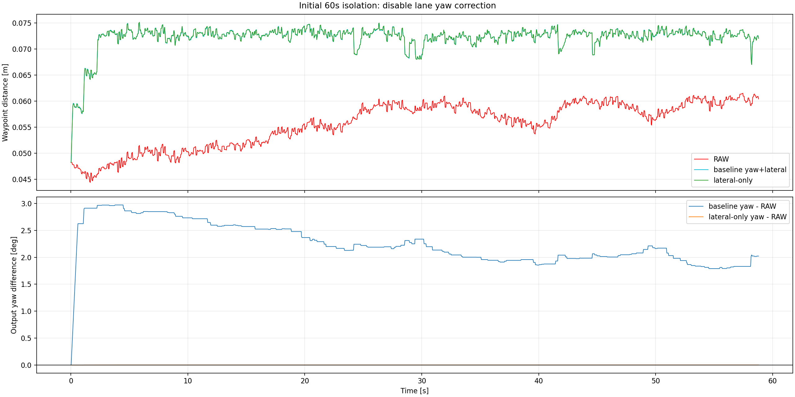

# 초기 직진 60초 lateral-only 분리 실험

## 실험 조건

동일 rosbag 콜백에서 EKF 두 개를 병렬 실행했다.

- baseline: 현재와 동일한 lateral + yaw 차선 보정
- lateral-only: 같은 검출, 매칭, lateral correction을 사용하고 처음 60초 동안
  `yaw correction=0`으로 고정
- 재생 시간: 65초, 분석 구간: 처음 60초
- 단일 기록 `/clock`만 재생해 TF 시간 역행이 없는 실행
- 표본: odom 1,764개, 매칭 134회

## 결과

| 출력 | 평균 waypoint 거리 | RMSE | P95 | 최대 |
|---|---:|---:|---:|---:|
| RAW | 0.05557 m | 0.05574 m | 0.06059 m | 0.06151 m |
| baseline yaw+lateral | 0.07222 m | 0.07226 m | 0.07398 m | 0.07514 m |
| lateral-only | 0.07222 m | 0.07226 m | 0.07399 m | 0.07516 m |

- baseline과 lateral-only 위치 차이: 평균 `0.058 mm`, 최대 `0.211 mm`
- 두 출력의 yaw 차이: 평균 `2.26°`, 최대 `2.97°`
- 차선 lateral correction: 평균 `+0.0165 m`, 범위 `+0.0067~+0.0269 m`
- 첫 60초 waypoint 거리 악화: baseline `+0.01665 m`, lateral-only `+0.01665 m`

## 판단

yaw 출력은 약 2~3° 다르지만 두 위치와 waypoint 거리 결과는 사실상 동일하다. 따라서
초기 waypoint 오차 증가를 초기 yaw Kalman gain 탓으로 설명할 수 없다. 직접적인 변화는
두 실험에 공통으로 들어간 약 `+1.65 cm` lateral pose correction이다.

다만 이 bag에는 독립적인 simulator true pose가 없다. waypoint와 lane map 자체가 평균
약 5.29 cm 다르므로, lateral correction이 실제 위치를 악화시켰다고 이 결과만으로
확정할 수도 없다. 확정 가능한 결론은 다음 두 가지다.

1. 초기 waypoint 거리 악화는 yaw correction을 꺼도 사라지지 않는다.
2. 초기 lateral 측정 또는 waypoint 평가 기준을 다음 분리 대상으로 봐야 한다.

다음 실험은 첫 60초 동안 `lateral correction=0`인 RAW 유지 출력과 현재 lateral 보정을
비교해야 한다. 실제 정확도 판정에는 simulator true pose를 별도 기록한 bag이 필요하다.

원시 결과는 `pose_waypoint_metrics.csv`, `matching_ekf_metrics.csv`, 집계값은
`09_initial_lateral_only_experiment.json`에 저장했다.
