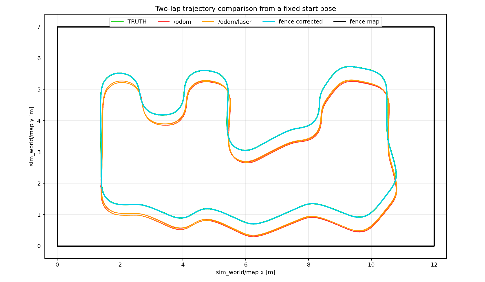
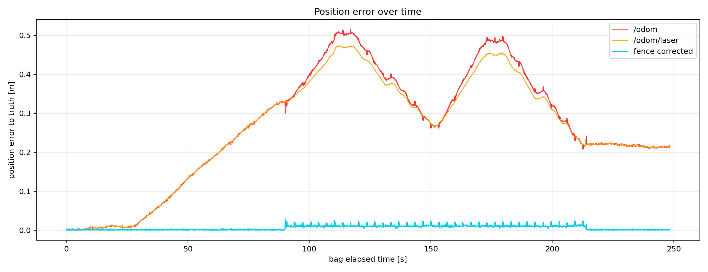
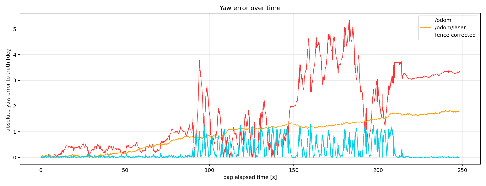
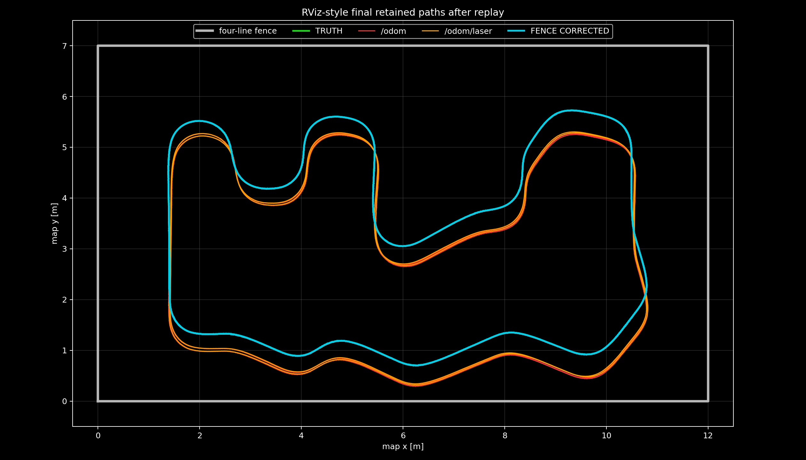

# 네 직선 LiDAR 펜스 보정 성능 분석

## 조건

- 고정 시작 pose: `map (1.4 m, 3.4 m, -pi/2 rad)`
- 보정 입력: `/odom`, `/scan_filtered`, 고정 펜스 `x=0, x=12, y=0, y=7`
- 비교 전용: `/odom/laser`, `/sim/ground_truth/tf`
- simulator truth는 최초 정렬과 fence matcher 입력에 사용하지 않았다.

## 궤적

## 위치 오차

| 출력 | RMSE | Median | P95 | Max |
|---|---:|---:|---:|---:|
| `/odom` | 0.3065 m | 0.2775 m | 0.4870 m | 0.5155 m |
| `/odom/laser` | 0.2944 m | 0.2743 m | 0.4529 m | 0.4737 m |
| fence corrected | 0.0080 m | 0.0039 m | 0.0126 m | 0.0291 m |

## Yaw 오차

| 출력 | RMSE | Median | P95 | Max |
|---|---:|---:|---:|---:|
| `/odom` | 2.215 deg | 1.053 deg | 4.323 deg | 5.347 deg |
| `/odom/laser` | 1.102 deg | 1.123 deg | 1.731 deg | 1.841 deg |
| fence corrected | 0.426 deg | 0.051 deg | 1.006 deg | 1.387 deg |

## RViz 색상과 종료 화면

- 초록: simulator truth
- 빨강: `/odom`
- 주황: `/odom/laser`
- 청록: fence corrected `/odom/calibride`
- 회색: `12 m x 7 m` 외곽 펜스

이 이미지는 Docker ROS 2 Jazzy에서 bag을 끝까지 재생한 뒤 멈춘 실제 RViz 창을
캡처한 것이다. 회색 사각형은 `12 m x 7 m` 펜스이며 초록 truth, 빨강 `/odom`,
주황 `/odom/laser`의 차이를 한 화면에서 확인할 수 있다. 청록 fence corrected는
truth와 거의 겹치는 구간이 많아 최종 pose 라벨과 `04_rviz_style_final_paths.png`도
함께 확인한다. 재생 조건과 수신 포인트 수는 `RVIZ_REPLAY.md`에 기록했다.

## 매칭 상태

- scan 보정 채택: 2484 / 2484 (100.0%)
- point-to-line RMS median: 0.0085 m
- point-to-line RMS P95: 0.0091 m
