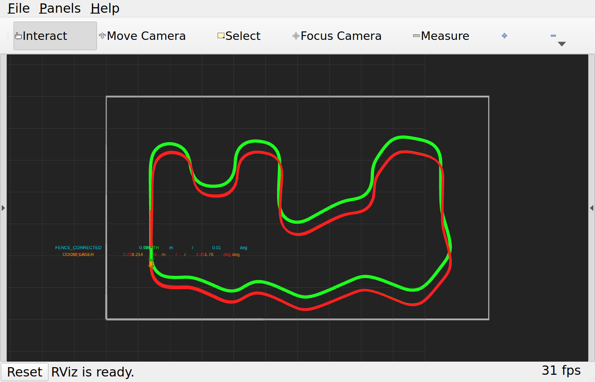

# 실제 RViz rosbag 재생 증거

## 실행 조건

- bag: `strict_two_lap_full_20260823_152110`
- 환경: `osrf/ros:jazzy-desktop`, software OpenGL 4.5, X11 실제 창
- 재생 속도: `3.0x`, 마지막 메시지까지 정상 종료
- 보정 입력: `/odom`, `/scan_filtered`
- 비교 전용: `/odom/laser`, `/sim/ground_truth/tf`
- 제외: bag에 저장된 기존 `/odom/calibride` (현재 fence node가 새로 발행)
- 중앙 노란선·카메라 토픽: 재생 및 보정 입력에서 제외

## 재생 종료 뒤 유지된 Path

| RViz 표시 | 입력 | 종료 뒤 pose 수 | 색상 |
|---|---|---:|---|
| simulator truth | `/sim/ground_truth/tf` | 3269 | 초록 |
| raw odometry | `/odom` | 2993 | 빨강 |
| LiDAR odometry | `/odom/laser` | 2137 | 주황 |
| fence corrected | 실행 중 생성한 `/odom/calibride` | 2993 | 청록 |

3배속 시각화에서는 ROS 구독 큐가 bag 원본 메시지 전체를 보존하지 않으므로 위 수는
정량 평가 표본 수가 아니다. 성능 표와 그래프는 MCAP 원본 전체를 순차 처리한
`summary.json`, `pose_errors.csv`, `laser_pose_errors.csv`를 기준으로 한다.

## 종료 화면

RViz bridge는 누적 Path를 1초마다 다시 발행하므로 bag 재생이 멈춘 뒤에도 화면과
토픽에 마지막 전체 궤적이 남는다. `Panels` 메뉴에서 Displays를 켜면 각 경로를
개별 on/off 하며 겹치는 구간을 확인할 수 있다.
