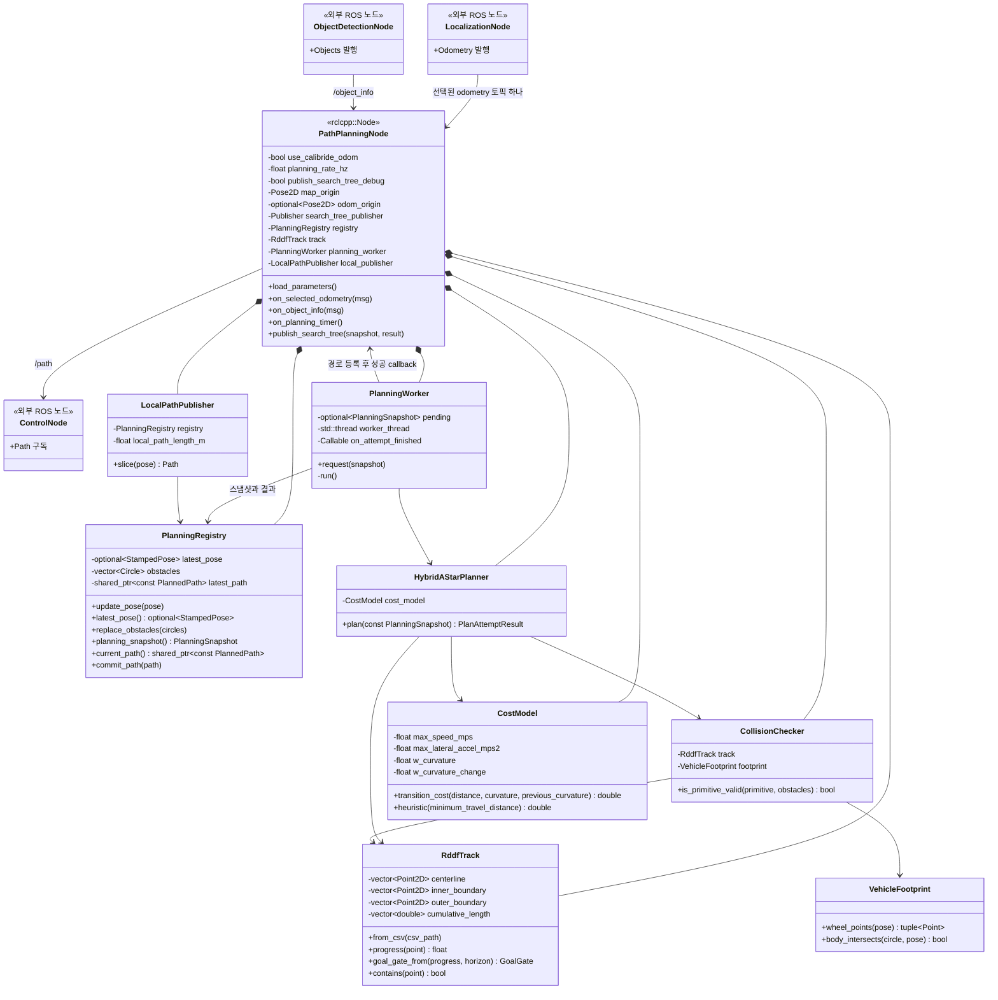
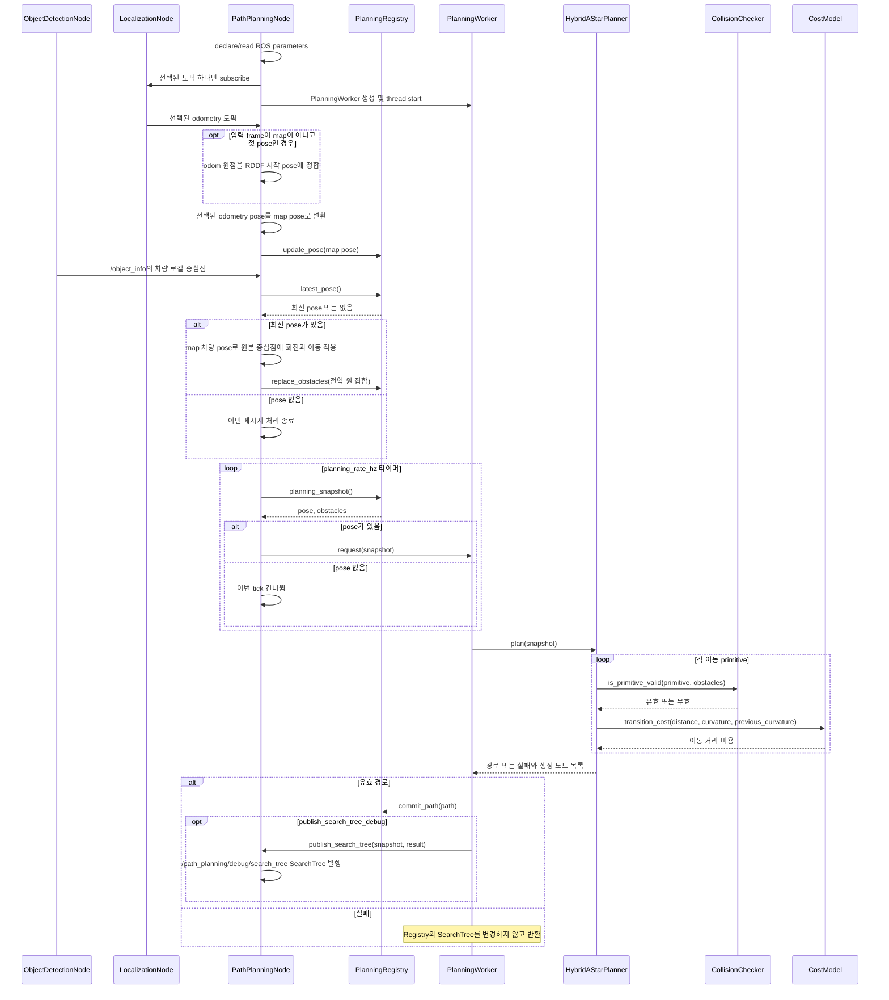
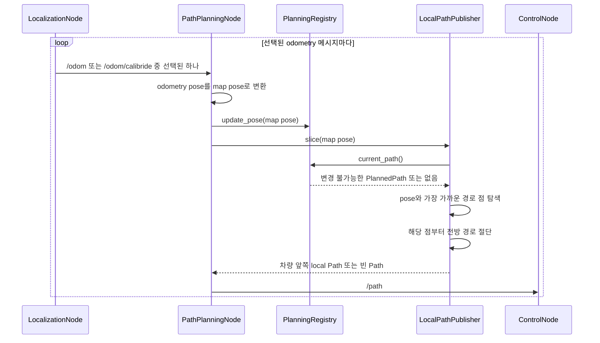

# 경로 계획 노드 설계

## 1. 목표와 범위

`PathPlanningNode`는 폐곡선 RDDF, 차량 위치, 장애물 중심점을 이용하여 다음 조건을
만족하는 경로를 `/path`로 발행한다.

- 네 바퀴가 `innerbound`와 `outerbound` 사이의 트랙 영역을 벗어나지 않는다.
- 설정값으로 팽창한 원형 장애물과 차량이 충돌하지 않는다.
- Hybrid A*로 주행 가능한 경로를 생성한다.
- 현재 비교 실험에서는 주행 가능한 경로의 누적 길이를 최소화한다.
- Raspberry Pi 5 8 GB에서 계획 연산과 고주기 로컬 경로 발행을 함께 수행한다.

한 랩의 기준점은 `rddf/rddf.csv` 첫 번째 centerline 점이다. 차량 크기는 폭 0.20 m,
길이 0.28 m, 휠베이스 0.18 m이다.

이 문서는 C++17 `rclcpp` 구현과 함께 유지하는 설계 문서다. 문서의 클래스명과 책임은
실제 구현 객체에 대응시키는 것을 원칙으로 한다. 이번 구현 범위는
`PathPlanningNode`와 `interfaces/SearchTree`까지다.

## 2. 좌표계와 전제

RDDF 좌표를 전역 `map` 좌표로 사용한다. 선택된 odometry의 로컬 pose를 Registry에
직접 넣지 않는다. 첫 odometry pose를 RDDF 첫 centerline 점과 첫 segment의 진행
방향에 정합하여 고정된 2D 강체변환을 만든 뒤, 이후 모든 odometry pose를 `map`으로
변환한다. 입력 메시지의 frame이 이미 `map`이면 변환 없이 사용한다.

- 선택된 odometry pose는 차량 뒤 차축 중심의 `(x_odom, y_odom, yaw_odom)`를 나타낸다.
- 첫 odometry pose `(x_0, y_0, yaw_0)`가 수신될 때 차량은 RDDF 첫 centerline 점에 있고
  첫 segment 방향을 향한다고 전제한다.
- RDDF 시작 pose를 `(x_map0, y_map0, yaw_map0)`라 하고
  `delta_yaw = yaw_map0 - yaw_0`로 둔다.
- `/object_info`의 중심점은 뒤 차축 중심 기준 차량 로컬 좌표다. `+x`는 전방, `+y`는
  좌측이다.
- Object Detection Node가 LiDAR 장착 위치에서 뒤 차축 중심까지의 고정 오프셋을 먼저
  반영하여 위 차량 로컬 좌표 계약을 만족해야 한다.
- Path Planning Node는 먼저 odometry pose를 다음과 같이 `map` pose로 변환한다.

```text
dx = x_odom - x_0
dy = y_odom - y_0
x_map = x_map0 + cos(delta_yaw) * dx - sin(delta_yaw) * dy
y_map = y_map0 + sin(delta_yaw) * dx + cos(delta_yaw) * dy
yaw_map = normalize(yaw_odom + delta_yaw)
```

그다음 최신 `map` 차량 pose로 장애물 로컬 중심점을 회전·이동한다. RDDF, 차량 pose,
장애물, 계획 경로와 탐색 트리는 모두 `map` 좌표다. 고정 변환은 노드 내부의 시작 pose
두 개로 직접 계산하므로 별도의 TF 조회나 `TransformBuffer`는 필요하지 않다.

휠 트랙 실측 전에는 차량 폭과 같은 0.20 m를 사용한다. 이는 네 바퀴 경계 조건에 대해
보수적인 가정이다.

## 3. 입출력 계약

| 구분 | 이름 | 형식 | 계약 |
|---|---|---|---|
| 정적 입력 | `rddf_file` | CSV 경로 | `center_x_m,center_y_m,inner_x_m,inner_y_m,outer_x_m,outer_y_m` 열을 가진 폐곡선 |
| 동적 입력 | `/odom` | `nav_msgs/Odometry` | `use_calibride_odom: false`일 때만 구독하는 차량 pose와 속도 |
| 동적 입력 | `/odom/calibride` | `nav_msgs/Odometry` | `use_calibride_odom: true`일 때만 구독하는 차량 pose와 속도 |
| 동적 입력 | `/object_info` | `interfaces/Objects` | 뒤 차축 중심 기준 차량 로컬 좌표의 장애물 중심점 |
| 출력 | `/path` | `nav_msgs/Path` | `map` 좌표의 전방 로컬 구간, pose 방향 포함 |
| 디버그 출력 | `/path_planning/debug/search_tree` | `interfaces/SearchTree` | `map` 좌표인 직전 성공 Hybrid A* 탐색의 노드 위치·yaw와 parent index |

`Objects` 메시지에는 장애물 반지름이 없다. 따라서 모든 장애물은 설정의
`obstacle_inflation_radius_m`을 기본 반지름으로 갖는 원으로 취급한다. 이 값에는 실제
장애물 크기, 인식 및 위치 오차와 안전 여유를 포함한다. 노드가
반지름을 자동으로 추가 팽창하지 않으며 안전 여유는 이 YAML 값으로 직접 튜닝한다.
차량 크기는 별도의 차량 직사각형 충돌 검사에서 한 번만 반영한다. 좌표가 유효하지 않은
관측은 사용하지 않고 진단 로그를 남긴다.

노드는 시작할 때 `use_calibride_odom`을 한 번 읽고 선택된 odometry 토픽 하나에만
subscription을 만든다. `true`이면 `/odom/calibride`만 사용하고 `/odom`은 구독하거나
fallback으로 사용하지 않는다. `false`이면 `/odom`만 사용한다.

## 4. 실행 전략과 고정 주기 계획

계획 연산과 로컬 경로 발행의 주기를 분리한다.

CPU 사용량 대부분을 차지하는 상태 확장, 우선순위 큐, primitive 보간 및 충돌 검사는
CPython 바이트코드가 아니라 C++17 네이티브 코드로 실행한다. 계획은 별도
`std::thread`에서 수행하므로 ROS callback executor를 막지 않는다.

- 선택된 odometry 콜백은 pose를 갱신하고 현재 경로의 앞쪽 구간을 잘라 `/path`로
  발행한다. 로컬 경로 발행 주기는 선택된 odometry 수신 주기와 같다.
- `planning_rate_hz` 타이머는 매 주기마다 최신 `PlanningSnapshot`을 읽고 pose가 있으면
  `PlanningWorker.request(snapshot)`을 호출한다. 거리, 남은 경로, 횡방향 오차,
  heading 오차, 경로 나이 조건은 사용하지 않는다.
- 선택된 odometry pose를 아직 받지 않았을 때만 해당 tick의 요청을 건너뛴다.
- 계획 워커가 쉬고 있으면 요청을 즉시 실행한다. 이미 실행 중이면 큐를 늘리지 않고
  단일 pending 슬롯을 최신 스냅샷으로 교체한다. 실행 중인 탐색은 중간 취소하지 않으며,
  끝난 직후 pending 스냅샷 하나를 이어서 처리한다.
- 계획에 성공하면 생성된 경로를 Registry에 등록한다. `/object_info` 콜백은 최신 pose로
  변환한 장애물 목록만 교체하며 기존 경로를 자동으로 무효화하지 않는다.

타이머의 주기는 `1 / planning_rate_hz`초다. Hybrid A* 한 번의 실행 시간이 이 주기보다
길면 실제 새 경로 생성률은 설정 Hz보다 낮아질 수 있지만, pending 슬롯이 하나뿐이므로
오래된 요청이 누적되지는 않는다. 초기값은 3 Hz이며 Raspberry Pi 5에서 측정한 계획
시간에 따라 YAML에서 조정한다.

현재 개발 및 기능 검증 환경은 Raspberry Pi 5나 실차가 아니라 임시 SIM 호스트다. 이
호스트에서 얻은 계획 시간과 발행률은 기능 회귀 확인용일 뿐 Raspberry Pi 5 성능을
보장하지 않는다. 실제 `planning_rate_hz`와 시간 예산은 Raspberry Pi 5 8 GB에 배포한 뒤
동일한 RDDF·장애물 시나리오로 다시 계측해 확정한다.

### 4.1 계획 실패

Hybrid A*가 경로를 찾지 못하면 경로 및 Registry에 대해서는 아무 작업도 하지 않고
반환한다. 이전 경로 재검사, Registry 갱신, 경로 무효화, 빈 `Path` 강제 발행을
수행하지 않는다. Registry에 성공 경로가 한 번 등록된 뒤에는 이후 계획 실패와 무관하게
같은 경로를 유지하고, 매 odometry 콜백에서 계속 전방 구간을 잘라 발행한다.

다음 `planning_rate_hz` tick에서는 최신 pose와 장애물로 다시 계획을 요청한다.

로컬 경로 발행 주기는 선택된 odometry 수신 주기이며, 목표인 30~50 Hz를 내려면
odometry도 같은 수준으로 들어와야 한다. 탐색은 벽시계 시간으로 중단하지 않으며,
`planning_horizon_m`과 `max_search_nodes`로 문제 크기와 메모리만 제한한다.

### 4.2 탐색 트리 디버그 발행

고주기 odometry 콜백의 `slice(pose)`는 Registry 경로를 잘라 발행할 뿐 탐색 트리를
만들지 않는다. 전체 트리는 저주기 `HybridAStarPlanner`가 성공한 경우에만 한 번
발행한다. PlanningWorker는 성공 경로를 Registry에 먼저 등록한 뒤 SearchTree를
발행한다. 따라서 SearchTree 수신은 대응 경로가 이미 Registry에 있다는 뜻이다.
실패한 탐색은 Registry와 SearchTree 모두 변경하거나 발행하지 않는다.

`PathPlanningNode`는 `/path_planning/debug/search_tree`에
`interfaces/msg/SearchTree` 하나만 발행한다. 구현 시
`src/interfaces/msg/SearchTree.msg`를 다음과 같이 추가한다.

```text
std_msgs/Header header
float32[] x
float32[] y
float32[] yaw
int32[] parent_index
int32 final_node_index
```

네 배열의 길이는 모두 노드 수 `N`으로 같아야 한다. `(x[i], y[i], yaw[i])`가 노드 `i`의
전역 계획 pose이며 yaw 단위는 radian, 범위는 `[-pi, pi)`다. `parent_index[i]`는 부모 노드
index다. 시작 노드는 index 0이며 parent는 `-1`, 나머지 값은 `[0, N)` 범위여야 한다.
`final_node_index`부터 parent를 시작 노드까지 역추적하면 성공한 최종 경로가 된다.
배열 길이가 이미 노드 수를 나타내므로 별도 `length` 필드는 두지 않는다. g, h,
open/closed 상태와 z 좌표는 넣지 않는다. 동적 데이터 크기는 CDR 정렬과 header를 제외하면
노드당 16 byte다.

노드별 `SearchTreeNode` 배열은 두 번째 사용자 정의 메시지와 노드 수만큼의 중첩
메시지 객체가 필요하므로 사용하지 않는다. 네 기본형 배열을 가진 메시지 하나만
사용한다.

여기서 전체 트리는 탐색 종료 시 open/closed에 남은 모든 유효 생성 상태와 각 상태의
실제 parent 관계다. 시작 상태와 충돌 또는 트랙 이탈로 거부된 primitive는 간선에
포함하지 않는다. 같은 양자화 key가 더 낮은 비용으로 다시 발견되면 기존 record의 pose와
parent를 바꾸지 않고 새 record를 추가한다. 따라서 각 parent 간선은 실제 충돌 검사한
primitive를 계속 나타내며, 디버그 트리에는 해당 key의 개선 이력이 함께 남을 수 있다.

`publish_search_tree_debug`가 `false`이면 배열 구성과 발행을 모두 생략한다. 원본
`SearchTree` 토픽은 계획을 막지 않도록 `KEEP_LAST(1)`, `BEST_EFFORT`, `VOLATILE`을
사용한다. 이 옵션은 별도 발행 주기를 두지 않고 계획 완료율을 그대로 따르며, 트리를
Registry에 저장하거나 odometry 콜백에서 다시 발행하지 않는다. Marker 변환 및 RViz
표시는 이번 구현 범위 밖의 별도 소비자 책임이다.

## 5. 클래스 다이어그램

`PlanningRegistry`는 별도의 경로 저장소가 아니라 ROS 콜백과 계획 워커 사이의 동기화
경계다. 최신 pose, 장애물과 경로를 잠금 하나 아래 관리하여 계획용 스냅샷과 발행용 경로
참조를 일관되게 제공한다.



`Pose2D`, `Circle`, `PlanningSnapshot`, `PlanAttemptResult`는 값으로 전달한다. 경로만
크기가 커질 수 있으므로 Registry가 최신 `PlannedPath`를
`shared_ptr<const PlannedPath>`로 공개하며, 등록 후 내부를 변경할 수 없다.
Registry는 잠금 안에서 일관된 스냅샷을 만들거나 최신 참조를 교체할 뿐이며 Hybrid A*
연산 중에는 잠금을 보유하지 않는다. ROS parameter는 각 동작 객체가 필요한 값을 시작
시 읽어 필드로 보유하며 별도의 Config 객체를 만들지 않는다.

## 6. 시퀀스 다이어그램

모든 열은 실제 ROS 노드 또는 `PathPlanningNode` 프로세스 메모리에 존재하는 클래스
인스턴스다. ROS 토픽 자체는 열에서 제외하고 메시지 화살표에 토픽명을 표시한다.

### 6.1 입력 갱신과 저주기 계획 요청



### 6.2 odometry 콜백 기반 로컬 경로 발행



### 6.3 `slice(pose)` 동작

`LocalPathPublisher`는 `PlanningRegistry`에 등록된 최신 `PlannedPath`를 대상으로 다음
순서로 동작한다.

1. 경로가 없거나 점이 하나도 없으면 빈 `Path`를 반환한다.
2. 현재 pose의 `(x, y)`와 모든 경로 점 사이의 제곱 유클리드 거리를 비교해 가장 가까운
   점의 index를 찾는다. 계획 경로 길이가 제한되어 있으므로 초기 구현은 별도 공간 색인이나
   상태 cache 없이 매 callback마다 단순 `O(N)` 탐색한다.
3. 가장 가까운 점을 첫 점으로 삼고, index가 증가하는 전방 방향으로 누적 길이가
   `local_path_length_m`에 도달할 때까지 잘라 `nav_msgs/Path`를 만든다. 가장 가까운 점
   이전의 경로는 포함하지 않는다.
4. `PlannedPath`의 끝에 먼저 도달하면 남은 경로만 발행하며 경로 처음으로 순환하지 않는다.

이 동작은 새 경로를 계획하거나 충돌을 다시 판정하지 않고, Registry의 변경 불가능한
경로 참조를 읽어 짧게 절단하는 일만 수행한다. 출력 header의 frame은 글로벌 계획 좌표를
유지하고 stamp는 해당 odometry message의 시각을 사용한다.

## 7. Hybrid A* 상태와 탐색

상태는 `(x, y, yaw, progress)`이며 탐색 키는
`(ix, iy, iyaw, iprogress)`로 양자화한다. `progress`는 centerline의 누적 거리다.
시작선 통과 시 한 랩 길이만큼 이어지는 값으로 처리한다. progress가 없으면 공간상
가까운 다른 트랙 구간으로 건너뛰거나 역방향으로 합류하는 잘못된 해를 선택할 수 있다.
자식 progress는 부모보다 `progress_regression_tolerance_m` 이상 후퇴할 수 없고, 한
primitive에서 `motion_primitive_length_m * max_progress_advance_ratio`보다 크게 전진할
수 없다. 비율을 1보다 크게 두어 타이트 코너의 안쪽 racing line은 허용하되 공간상
가까운 먼 centerline 구간으로 순간 이동하는 것은 막는다.

이동 primitive는 차량 최소 회전 반경을 만족하는 전진 원호만 사용한다. 경주 중 후진은
필요하지 않으므로 초기 구현에서는 제외한다. 각 primitive는
`collision_check_step_m` 간격으로 보간하여 끝점뿐 아니라 중간 pose도 검사한다.
검사에 사용한 중간 pose 전체를 경로에 보관하지 않고 primitive 끝점만 저장·발행하여
메모리와 메시지 크기를 줄인다.

`planning_horizon_m`은 centerline을 따라 현재 progress보다 앞선 기준점을 고르는
거리다. 기준점 하나에 정확히 수렴시키지는 않는다. 해당 기준점에서 centerline의 법선
방향으로 트랙을 가로지르는 목표 게이트를 만들고, 차량이 허용된 횡방향 위치와 yaw
오차 안에서 게이트를 전진 방향으로 통과하면 도달한 것으로 판정한다. 이렇게 해야
코너 탈출에서 centerline으로 불필요하게 복귀하지 않아 아웃-인-아웃 경로를 유지할 수
있다. 한 랩 전체 계획 모드에서는 시작선 게이트를 같은 진행 방향으로 한 번 통과한
상태가 목표다.

## 8. 최단거리 비교 비용

현재 비교 실험의 탐색 우선순위는 다음 비용의 합으로 정한다.

```text
f(n) = g_distance(n) + h_distance(n)
```

- `g_distance`는 이미 지나온 motion primitive 길이의 합이다.
- `h_distance`는 목표 게이트 선분까지의 유클리드 거리와 남은 centerline progress에서
  `goal_longitudinal_tolerance_m`을 뺀 뒤 0 이상으로 제한한다. progress 쪽은 다시
  `max_progress_advance_ratio`로 나누며, 두 거리 중 큰 값이 낙관적 거리 하한이다.
- 장애물은 별도 soft cost를 두지 않고, `obstacle_inflation_radius_m`과 차량 직사각형의
  hard collision으로만 거부한다.

기존 예상 시간·곡률·곡률 변화 비용식과 시간 heuristic은 비교 후 되돌릴 수 있도록
`CostModel` 구현에 주석으로 남겨 두었다. 이 실험 동안 `max_speed_mps`,
`max_lateral_accel_mps2`, `w_curvature`, `w_curvature_change`는 로드와 검증은 하지만 활성
비용에는 반영되지 않는다. 따라서 결과는 트랙·차량·장애물·운동학 조건을 만족하는 탐색
격자상의 최단거리 경로이며, 아웃-인-아웃이나 최소 랩타임을 직접 선호하지 않는다.

## 9. 트랙과 충돌 판정

`RddfTrack`은 inner/outer polyline을 연결해 주행 가능 polygon을 만든다. 각 pose에서
보수적인 네 휠 접점은 뒤 차축 중심 기준으로 다음과 같다.

```text
뒤 왼쪽  = (0,           +wheel_track_m / 2)
뒤 오른쪽 = (0,           -wheel_track_m / 2)
앞 왼쪽  = (wheelbase_m, +wheel_track_m / 2)
앞 오른쪽 = (wheelbase_m, -wheel_track_m / 2)
```

`track_margin_m`만큼 양쪽 경계를 트랙 안쪽으로 이동시킨 뒤, 네 점 모두 축소된 주행
가능 polygon 안에 있어야 한다. 기본 margin은 안정성 여유로 차량 폭과 같은 0.20 m다.
primitive 중간 pose에서도 같은 검사를 한다. 별도의 swept-volume 계산이나 표본 사이
자동 안전 padding은 두지 않는다. 실제 안전 여유는 `collision_check_step_m`을 충분히
작게 하고 `track_margin_m`을 충분히 크게 설정하여 직접 튜닝한다.

반복 탐색 중 매 휠마다 전체 boundary를 순회하지 않도록 노드 시작 시
`track_lookup_resolution_m` 간격의 signed-clearance lookup grid를 한 번 만든다. 조회할
때는 가장 가까운 grid 표본의 여유가 `track_margin_m + 표본까지의 거리` 이상일 때만
유효하다고 판정한다. 경계까지의 거리가 1-Lipschitz라는 성질을 이용한 보수적 조건이라
grid 근사 때문에 트랙 밖 점을 안으로 허용하지 않는다.

장애물은 설정 반지름으로 팽창한 원이다. 네 휠 조건과 별개로 길이 0.28 m, 폭 0.20 m인
차량 직사각형과 원의 교차를 검사하여 차체 충돌도 막는다. 트랙 경계에는 요구사항대로
휠 접점을 적용하고 장애물에는 차체 전체를 적용한다. 별도 오버행 실측값이 없으므로
`(vehicle_length_m - wheelbase_m) / 2`를 앞뒤에 동일하게 배분한다. 현재 제원에서는
뒤 차축 뒤 0.05 m부터 앞 차축 앞 0.05 m까지가 차체 직사각형이다.

경량화를 위해 장애물 주변의 추가 soft-clearance 비용과 연속 swept collision은 두지
않는다. 장애물 크기·인식 오차·원하는 안전 여유는 `obstacle_inflation_radius_m` 하나에
포함하고, 원호 표본 간격은 `collision_check_step_m`으로 조정한다.

## 10. 설정 파일과 튜닝값 관리 원칙

`src/path_planning/config/path_planning.yaml`을 Path Planning의 모든 튜닝 가능한
파라미터에 대한 단일 기준으로 사용한다. 차량 제원, 안전 여유, 계획 주기와 해상도,
예상 속도 제한값과 곡률 비용 가중치는 기존 비용식 복원 시 사용할 값으로 유지하며 다른
소스 파일에 중복 하드코딩하지 않는다.

노드 시작 과정은 다음과 같다.

1. `src/path_planning/launch.sh`가 설치된 `path_planning.yaml`을
   `--ros-args --params-file`로 지정해 `PathPlanningNode`를 실행한다.
2. `PathPlanningNode`는 필요한 parameter의 이름과 타입을 선언하고 YAML에서 로드된 값을
   한 번 읽는다. 누락, 타입 오류, 범위 오류가 있으면 기본값으로 조용히 대체하지 않고
   시작을 실패시킨다.
3. 노드는 검증한 숫자와 boolean을 `RddfTrack`, `PlanningWorker`,
   `HybridAStarPlanner`, `CollisionChecker`, `CostModel`, `LocalPathPublisher` 생성자에
   전달한다.
4. 각 동작 객체는 전달받은 값을 필드로 보유한다. 객체가 YAML을 다시 열거나 ROS
   parameter server를 반복 조회하지 않는다.

따라서 튜닝은 이 YAML만 수정해서 수행한다. YAML은 설정 데이터이지 상호작용하는
런타임 객체가 아니므로 클래스 및 시퀀스 다이어그램의 열에는 넣지 않는다.
`CMakeLists.txt`가 YAML과 RDDF를 패키지 share 디렉터리에 설치하고 `launch.sh`는 설치된
YAML을 `--params-file`로 전달한다.

최소 parameter 집합은 다음과 같다.

```yaml
path_planning_node:
  ros__parameters:
    rddf_file: "rddf/rddf.csv"
    use_calibride_odom: false
    vehicle_width_m: 0.20
    vehicle_length_m: 0.28
    wheelbase_m: 0.18
    wheel_track_m: 0.20
    obstacle_inflation_radius_m: 0.25  # 실측 후 확정
    track_margin_m: 0.20
    track_lookup_resolution_m: 0.05
    planning_rate_hz: 3.0
    publish_search_tree_debug: false
    planning_horizon_m: 8.0
    local_path_length_m: 3.0
    xy_resolution_m: 0.05
    yaw_resolution_deg: 5.0
    collision_check_step_m: 0.025
    motion_primitive_length_m: 0.20
    max_steering_angle_deg: 30.0
    steering_sample_count: 5
    progress_resolution_m: 0.10
    goal_longitudinal_tolerance_m: 0.15
    goal_yaw_tolerance_deg: 20.0
    progress_regression_tolerance_m: 0.05
    max_progress_advance_ratio: 3.0
    max_search_nodes: 100000
    max_speed_mps: 1.5
    max_lateral_accel_mps2: 1.5
    w_curvature: 1.0
    w_curvature_change: 0.2
```

위 YAML의 숫자는 초기 튜닝값이며 트랙 실측과 주행 기록으로 확정한다. 별도의 Config
객체는 만들지 않는다. 설정 스키마 검증은 `PathPlanningNode`에서 한 번 수행하고, 모든
동작 객체는 검증된 값만 전달받는다. 코드 변경 없이 YAML 변경과 노드 재시작만으로
튜닝값이 반영되어야 한다.

## 11. 실패 처리

- RDDF 열 누락, 비수치 값, 폐곡선 불일치, 자기 교차, inner/outer 역전은 노드 시작
  실패로 처리한다.
- 장애물 메시지는 `0 <= length <= 20`인지 확인하고 NaN/Inf 좌표를 거부한다.
- 시작 pose가 이미 트랙 밖이거나 장애물과 충돌하면 탐색을 시작하지 않는다.
- Hybrid A* 실패 시 Registry를 변경하거나 SearchTree를 발행하지 않는다.
- 성공 시 Registry에 경로를 먼저 등록하고, `publish_search_tree_debug: true`일 때만
  해당 성공 탐색의 SearchTree를 이어서 발행한다.
- 종료 시 계획 워커에 중단 신호를 보내고 thread를 합류한 뒤 노드를 파괴한다.

## 12. 검증 기준

1. 직선, 좌·우 코너, 시작선에서 모든 primitive의 네 휠이 트랙 내부에 있다.
2. 정적 장애물의 팽창 원과 차량 직사각형이 교차하지 않는다.
3. 유효한 odometry가 있는 동안 `planning_rate_hz`의 매 tick마다 계획 요청이 생성되고,
   계획 중에도 pending 요청은 하나를 넘지 않는다.
4. 장애물 중심점은 최신 선택 odometry pose로 전역 변환한 뒤 양자화 없이 Registry의
   장애물 목록을 교체한다. 이 입력 갱신은 Registry의 기존 경로를 바꾸지 않는다.
5. 첫 로컬 odometry pose는 RDDF 첫 centerline 점과 첫 segment yaw에 일치하도록
   `map`으로 변환되고, Registry pose, 장애물, `/path`, SearchTree의 frame은 모두
   `map`이다.
6. 같은 길이의 primitive는 곡률과 곡률 변화에 관계없이 같은 비용이다.
7. 더 짧은 경로에서 누적 거리 비용이 감소한다.
8. 유효한 선택 odometry 메시지마다 `/path`를 한 번 발행하고, Raspberry Pi 5에서
   odometry 콜백부터 발행까지의 95 백분위 지연이 제어 주기 예산 안에 든다.
9. `slice(pose)` 결과의 첫 점은 Registry 경로에서 현재 위치와 가장 가까운 점이고, 이후
   점은 원본 index가 증가하는 방향으로만 이어진다. 경로 끝에서는 처음으로 순환하지 않는다.
10. 성공 경로를 Registry에 등록한 뒤에만 `SearchTree`를 정확히 한 번 발행한다.
    `x`, `y`, `yaw`, `parent_index` 길이는 같고 yaw는 유한한 `[-pi, pi)` 값이다. 시작
    노드의 parent는 `-1`, 나머지 parent는 유효한 index다. 실패하거나
    `publish_search_tree_debug: false`이면 배열을 발행하지 않는다.
11. Hybrid A* 실패 전후로 Registry의 기존 경로 참조가 바뀌지 않는다.

## 13. 구현 순서

1. RDDF 파서, 폐곡선 progress index, 네 휠 및 장애물 충돌 판정과 단위 시험
2. 비용 최적화 전 Hybrid A*와 직선·코너 결정론 시험
3. 최단거리 비용 회귀 시험
4. `SearchTree` 인터페이스, ROS 콜백, PlanningRegistry, 계획 워커와 고주기 로컬 경로 절단기 통합
5. rosbag 재생과 Raspberry Pi 5 시간 예산 계측 후 설정값 조정
